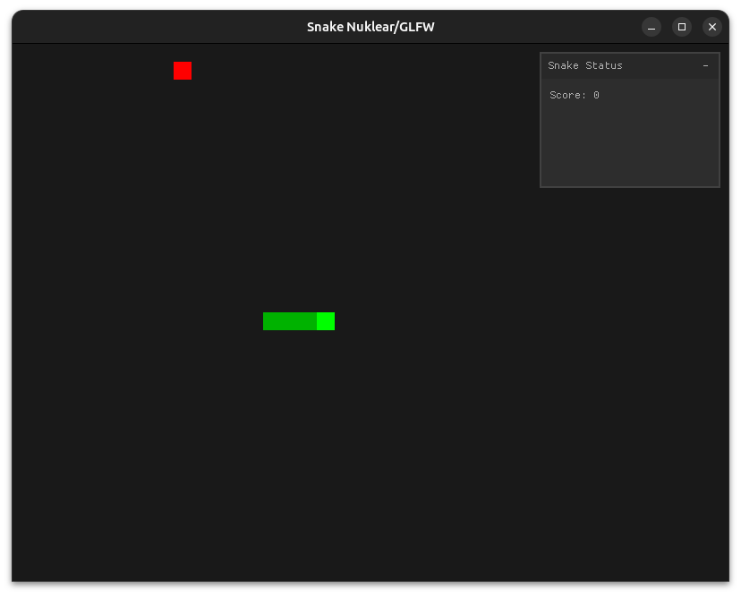

# Snake Game en C con OpenGL y Nuklear

Una implementación sencilla del clásico juego Snake escrita en C, utilizando OpenGL moderno para el renderizado y la biblioteca Nuklear para la interfaz gráfica de usuario (GUI).



## Características

*   Jugabilidad clásica de Snake.
*   Puntuación en tiempo real.
*   Interfaz gráfica simple creada con Nuklear para mostrar el estado del juego (puntuación, game over) y reiniciar la partida.
*   Renderizado con OpenGL 3.3+ y shaders (GLSL).
*   Proyecto configurado con CMake para una compilación sencilla en diferentes plataformas.

## Dependencias

Para compilar y ejecutar este proyecto, necesitarás tener instaladas las siguientes bibliotecas de desarrollo:

*   **GCC/Clang** (compilador de C)
*   **CMake** (>= 3.10)
*   **OpenGL**
*   **GLEW**
*   **GLFW3**

En sistemas basados en Debian/Ubuntu, puedes instalarlas con:
```bash
sudo apt-get update
sudo apt-get install build-essential cmake libglew-dev libglfw3-dev
```

## Compilación y Ejecución

Sigue estos pasos para compilar y ejecutar el juego:

```bash
# 1. Clona el repositorio
git clone https://github.com/IvanBits/snake.git
cd snake

# 2. Crea un directorio de compilación
mkdir build && cd build

# 3. Configura el proyecto con CMake
cmake ..

# 4. Compila el proyecto
cmake --build .

# 5. Ejecuta el juego
./snake_game
```

## Controles

*   **Teclas de Flecha**: Mover la serpiente.
*   **Botón "START Game"**: Iniciar o reiniciar una partida.

## Licencia

Este proyecto está bajo la Licencia MIT. Consulta el archivo `LICENSE.md` para más detalles.
